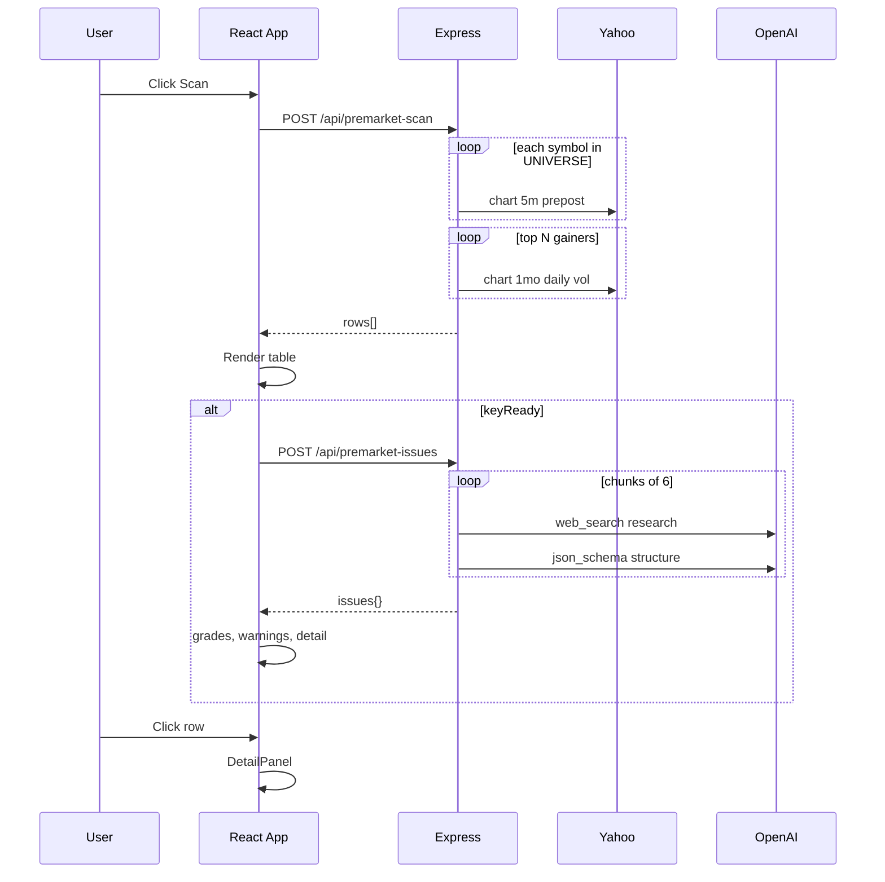

# PremarketScanner — AI 온보딩·기술 백과 (약 5만 자)

> **문서 목적**: 다른 AI 에이전트가 이 저장소를 처음 접했을 때, 제품 의도·아키텍처·데이터 흐름·파일 역할·확장 지점을 **추가 질문 없이** 이해하고 수정할 수 있도록 작성한 단일 레퍼런스 문서입니다.  
> **저장소**: https://github.com/hawonb711-tech/PremarketScanner  
> **버전 기준**: package.json `0.1.0`, ESM 전역, Node 22+ 권장.

---

## 0. AI에게 주는 한 줄 요약

**PremarketScanner**는 미국 주식 **프리마켓·장중**에 전일 종가 대비 크게 오른 종목을 **큐레이션된 대형·중형주 유니버스(~124종)** 에서 Yahoo Finance 무료 API로 스캔하고, OpenAI **웹검색 2-패스**로 “왜 올랐는지”를 한국어로 요약·분류·점수화해 **React 테이블 + 상세 패널**에 보여주는 로컬 웹앱이며, **Electron**으로 Mac `.dmg` 원클릭 앱도 패키징한다. 가격 스캔은 API 키 없이 동작하고, 이슈 분석만 OpenAI 키가 필요하다.

---

## 1. 제품 요구사항과 설계 철학

### 1.1 사용자가 원하는 경험

| 화면 요소 | 의미 | 구현 위치 |
|-----------|------|-----------|
| 종목·상승률·현재가·거래량 | 급등 순위표 | `ScanTable` + `/api/premarket-scan` |
| 주요 이슈 | 한 줄 요약 + 카테고리 태그 | `/api/premarket-issues` → `Issue.summary`, `categories` |
| 신뢰도 0~5 | 뉴스·출처 품질 | AI `reliability` + UI `Stars` |
| 매매 A~D | 매매 적합도 휴리스틱 | `tradeGrade()` 클라이언트 |
| 위험도 | 추격매수·잡주·뉴스 없음 등 | `riskLevel()` 클라이언트 |
| 고점 대비 위치 | 프리마켓 고점·시초가·전일 종가 대비 | `fetchPremarketQuote()` + `DetailPanel` |
| 관련주 | 테마 동조 종목 | AI `related` + `relatedNote()` |
| 경고 문구 | 뉴스 없음·고점 근접 등 | `buildWarnings()` |

### 1.2 의도적으로 하지 않은 것

- **실시간 브로커 연동·주문**: 없음. 조회·분석 도구만 제공.
- **전 종목 스크리너**: Yahoo rate limit·속도 때문에 **정적 UNIVERSE** 만 스캔.
- **실시간 시총 필터**: 무료 API에 시총이 없어 `tier` (mega/large/mid) **수동 큐레이션**으로 대체.
- **투자 조언**: UI·README에 면책. 점수는 휴리스틱이지 백테스트된 알파가 아님.

### 1.3 다른 프로젝트와의 관계

- **StockAnalyser(기업 연관 지도)** 와 **코드·저장소 완전 분리**. 통합 금지가 사용자 요구였음.
- PremarketScanner만의 관심사: **단기 급등 + 촉매 뉴스 + 리스크 라벨**.

---

## 2. 시스템 아키텍처

### 2.1 논리 구성도

```
┌─────────────────────────────────────────────────────────────────┐
│                        사용자 (브라우저 / Electron)               │
│  React App (src/App.tsx)                                         │
│    · 필터 UI · 스캔 테이블 · 상세 패널 · 설정( localStorage )      │
│    · 파생 점수: volumeLevel, tradeGrade, riskLevel, warnings     │
└───────────────────────────┬─────────────────────────────────────┘
                            │ fetch /api/*
                            ▼
┌─────────────────────────────────────────────────────────────────┐
│              Express 서버 (server/index.mjs)                       │
│    POST /api/premarket-scan   → prices.mjs + universe.mjs       │
│    POST /api/premarket-issues → OpenAI Responses (web_search)     │
│    GET  /api/health           → 키 존재 여부                      │
│    (패키징 시) static dist/   → SPA fallback                     │
└───────────┬─────────────────────────────┬───────────────────────┘
            │                             │
            ▼                             ▼
┌───────────────────────┐   ┌───────────────────────────────────┐
│ Yahoo Finance Chart API │   │ OpenAI API (Responses + web_search)│
│ (키 불필요, UA 헤더)     │   │ (OPENAI_API_KEY 또는 x-openai-key) │
└───────────────────────┘   └───────────────────────────────────┘
```

### 2.2 실행 모드 3가지

| 모드 | 명령 | 프론트 | API | 포트 |
|------|------|--------|-----|------|
| **개발 (분리)** | `npm run dev:all` | Vite `:5173` | Express `:8787` | Vite가 `/api` 프록시 |
| **서버만** | `npm run server` | 없음 | Express | 8787 |
| **Mac 앱** | Electron `.app` | `dist/` 정적 서빙 | 동일 프로세스 내 Express | 8787, `127.0.0.1` |
| **Electron 개발** | `npm run electron:dev` | 빌드된 dist | Electron이 `startServer()` 호출 | 8787 |

**개발 모드** (`vite.config.ts`): `/api` → `http://localhost:8787`, 타임아웃 600초(이슈 분석 장시간 대비).

**Mac 앱** (`electron/main.mjs`): `app.getPath('userData')` → `PMS_ENV_DIR` → `~/Library/Application Support/프리마켓 급등주 스캐너/.env` 자동 생성(예시 복사).

### 2.3 기술 스택

- **런타임**: Node.js ESM (`"type": "module"`)
- **프론트**: React 18 + TypeScript 5 + Vite 6
- **백엔드**: Express 4 + cors + dotenv
- **AI**: `openai` SDK → `client.responses.create` + `tools: [{ type: "web_search" }]`
- **데스크톱**: Electron 35 + electron-builder 25 (Mac DMG)
- **데이터**: Yahoo `query1.finance.yahoo.com/v8/finance/chart/...` (비공식, 무료)

---

## 3. 엔드투엔드 데이터 흐름

### 3.1 Phase A — 가격 스캔 (OpenAI 불필요)

**트리거**: 사용자 **🔍 스캔** → `App.runScan()` → `scanPremarket(filters)`.

**요청** `POST /api/premarket-scan` Body (기본값 서버 측):

```json
{
  "minChangePct": 5,
  "minPrice": 5,
  "minVolume": 0,
  "excludeMid": false,
  "limit": 25
}
```

**서버 처리 순서**:

1. `UNIVERSE` 배열 전 종목에 대해 `mapPool(UNIVERSE, 12, fetchPremarketQuote)` — 동시성 12.
2. 필터: `changePct >= minChangePct`, `price >= minPrice`, `volume >= minVolume`, `excludeMid` 시 `tier !== "mid"`.
3. `changePct` 내림차순 정렬 후 `limit`개(최대 40) 슬라이스.
4. 상위 종목만 `mapPool(..., 8, fetchAvgDailyVolume)` — `volumeRatio = volume / avgVolume`.
5. JSON 응답: `rows[]`, `asOf`, `universeSize`, `filters`.

**프론트 후처리**: 테이블 렌더. `issues`는 비움. `keyReady`이면 자동 `runIssues(rows)` 호출.

**예상 소요**: 유니버스 124 × (5분봉 1요청 + 상위만 일봉 1요청) ≈ 수십 초. 캐시 TTL 30초로 연속 스캔 완화.

### 3.2 Phase B — 이슈 분석 (OpenAI 필요)

**트리거**: 스캔 성공 후 자동 또는 **📰 이유 분석** → `fetchIssues(rows, config)`.

**요청** `POST /api/premarket-issues`:

```json
{
  "model": "gpt-5.5",
  "stocks": [{ "symbol": "MRVL", "name": "Marvell Technology", "changePct": 26.6 }]
}
```

**인증 우선순위**: `x-openai-key` 헤더 > `process.env.OPENAI_API_KEY`.

**서버 처리**:

1. 종목을 **6개씩 청크** (`chunk(items, 6)`).
2. 청크별 **병렬** `processIssueChunk` (청크 간 `Promise.all`).
3. 각 청크 **2-패스**:
   - **패스 1**: `web_search` + `issueResearchPrompt` → 자유 텍스트 + `url_citation` 수집.
   - **패스 2**: `json_schema` strict `ISSUE_SCHEMA` + 출처 URL 화이트리스트.
4. `bySymbol` 맵 병합 → `{ issues, allSources }`.

**프론트**: `issues[symbol]`로 테이블·상세 패널 갱신. `tradeGrade`, `riskLevel`, `buildWarnings`는 **클라이언트에서** scan row + issue 조합으로 계산.

**예상 소요**: 종목당 웹검색 2회 × 청크 수 → **수 분**. UI는 `analyzing` 상태 표시.

### 3.3 Phase C — UI 상호작용

- **행 클릭** → `selected` symbol → `DetailPanel`.
- **설정** → `localStorage` `pms.config` (`apiKey`, `model`).
- **필터** → `localStorage` `pms.filters`.

---

## 4. Yahoo Finance 연동 (`server/prices.mjs`)

### 4.1 공통

- **User-Agent**: Chrome 124 UA 문자열 (차단 완화).
- **에러**: HTTP 실패 시 `null` 반환(해당 종목 스킵), 스캔 전체는 계속.

### 4.2 `fetchPremarketQuote(symbol)`

**URL**:  
`GET .../v8/finance/chart/{symbol}?range=1d&interval=5m&includePrePost=true`

**파싱 핵심**:

- `meta.previousClose` / `chartPreviousClose` → `prevClose`
- 5분봉 배열을 `currentTradingPeriod.pre|regular|post` 타임스탬프로 구간 분할
- **프리 구간**: `preLast`, `preHigh`(high/max), `preVol` 합
- **정규 시작**: 첫 봉 open → `regOpen`
- **현재가**: `meta.regularMarketPrice` 우선, 없으면 마지막 close
- **session**: 마지막 봉 timestamp가 어느 구간인지
- **sessionHigh**: `max(preHigh, regularMarketDayHigh)` 또는 가용한 쪽

**산출 필드와 UI 매핑**:

| 필드 | 계산 | UI 라벨 |
|------|------|---------|
| `changePct` | (price/prevClose - 1)×100 | 상승률 |
| `fromHighPct` | (price/sessionHigh - 1)×100 | 고점 대비 |
| `fromOpenPct` | (price/regOpen - 1)×100 | 시초가 대비 |
| `preMarketHigh` | 프리 고점 | 프리마켓 고점 |
| `volume` | `regularMarketVolume` | 거래량 |

**캐시**: `quoteCache`, TTL **30초**.

### 4.3 `fetchAvgDailyVolume(symbol)`

**URL**: `range=1mo&interval=1d`  
최근 20거래일 유효 volume 평균 → `volumeRatio` 계산용. 세션당 캐시(`avgVolCache`, TTL 없음 = 앱 재시작까지).

### 4.4 `mapPool(items, limit, fn)`

워커 `limit`개가 인덱스를 atomic하게 가져가며 병렬 실행 — Yahoo 동시 요청 폭주 방지.

---

## 5. 유니버스 (`server/universe.mjs`)

### 5.1 구조

```javascript
{ symbol: "MRVL", name: "Marvell Technology", tier: "large" }
```

- **tier**: `mega` | `large` | `mid` — 시총 프록시(수동 라벨).
- **총 약 124종**: 빅테크, 반도체/AI, 소프트웨어, 금융, 바이오, 소비재, 에너지/EV, 중국 ADR, ETF(SPY/QQQ/SMH).
- **페니주·잡주**: 목록에 없음 + `minPrice` 기본 $5.

### 5.2 확장 방법

`UNIVERSE` 배열에 객체 추가만 하면 스캔 대상에 포함. 시총 API 연동 시 tier 자동화는 **미구현** — AI가 추가할 때 `tier` 수동 지정 필요.

---

## 6. OpenAI 이슈 파이프라인 (`server/premarket.mjs` + `index.mjs`)

### 6.1 카테고리 enum (`VALID_CATEGORIES`)

| 키 | 한글 라벨 | 의미 |
|----|-----------|------|
| earnings | 실적 발표 | ER 서프라이즈 등 |
| guidance | 가이던스 상향 | 전망 상향 |
| ai | AI 관련 | AI 수혜 내러티브 |
| analyst | 목표가 상향 | 리레이팅 |
| ma | M&A/인수합병 | |
| contract | 대형 계약 | 수주 |
| ceo | CEO 발언 | 임원 발언 |
| fda | FDA/임상 | 바이오 |
| short_squeeze | 숏스퀴즈 | |
| macro | 거시/섹터 | 섹터 베타 |
| none | 뉴스 없음 | **위험 플래그** |

### 6.2 신뢰도 `reliability` (0~5, AI가 채움)

프롬프트 가이드: 공시 5, 주요 언론 4~5, 애널리스트 3, 소셜 1~2, 뉴스 없음 0~1.  
서버는 `Math.min(5, Math.max(0, rl))` 클램프.

### 6.3 출처 화이트리스트

`collectSources(response)`가 Responses API `url_citation`만 수집.  
구조화 패스에서 `sources` 배열은 **화이트리스트 URL만** 허용 — 환각 URL 방지.

### 6.4 `processIssueChunk` 모델 파라미터

- 기본 모델: `gpt-5.5` (요청 body 또는 설정 UI).
- `isReasoning = /^(gpt-5|o\d)/i.test(model)` → reasoning effort `low`.
- 청크당 2× Responses 호출 → 비용·시간 큼.

---

## 7. HTTP API 레퍼런스

### 7.1 `GET /api/health`

```json
{ "ok": true, "hasEnvKey": true }
```

프론트 `checkServer()` — 서버 연결 + env 키 존재(브라우저 키와 별개).

### 7.2 `POST /api/premarket-scan`

**Response `rows[]` 항목** (`ScanRow` 타입과 1:1):

- `symbol`, `name`, `exchange`, `tier`, `session`
- `prevClose`, `price`, `changePct`
- `preMarketPrice`, `preMarketChangePct`, `preMarketHigh`, `sessionHigh`
- `fromHighPct`, `regularOpen`, `fromOpenPct`
- `volume`, `avgVolume`, `volumeRatio`

### 7.3 `POST /api/premarket-issues`

**Response**:

```json
{
  "issues": {
    "MRVL": {
      "symbol": "MRVL",
      "summary": "...",
      "theme": "AI 반도체/데이터센터",
      "categories": ["ai", "ceo"],
      "reliability": 4,
      "related": ["NVDA", "AVGO"],
      "sources": ["https://..."]
    }
  },
  "allSources": ["https://..."]
}
```

**에러 400**: 키 없음, `stocks` 빈 배열.

---

## 8. 프론트엔드 (`src/`)

### 8.1 파일 역할

| 파일 | 역할 |
|------|------|
| `main.tsx` | React root, `styles.css` |
| `App.tsx` | 전체 UI·상태·스캔/분석 오케스트레이션 |
| `premarket.ts` | 타입, API 클라이언트, **점수 휴리스틱** |
| `styles.css` | 다크 테마, 테이블·패널·경고 박스 |

### 8.2 `App.tsx` 상태 머신 (요약)

```
초기 → checkServer()
스캔 클릭 → scanning=true → scanPremarket → rows 설정
         → keyReady ? runIssues : 종료
이슈 분석 → analyzing=true → fetchIssues → issues 설정
행 선택 → selected symbol → DetailPanel
```

**localStorage 키**:

- `pms.config`: `{ apiKey?, model }` 기본 model `gpt-5.5`
- `pms.filters`: `{ minChangePct:5, minPrice:5, minVolume:0, excludeMid:false, limit:25 }`

**`keyReady`**: `server.hasEnvKey || config.apiKey` — 둘 중 하나면 이슈 분석 가능.

### 8.3 컴포넌트 트리

- `App`
  - `FilterBar` — 필터 + 스캔/이유 분석 버튼
  - `ScanTable` — 8열 테이블
  - `DetailPanel` — 가격 그리드, 경고, 이슈, 관련주, 출처
  - `SettingsModal` — API 키·모델

### 8.4 클라이언트 점수 알고리즘 (`premarket.ts`) — 수정 시 핵심

#### `hasRealNews(issue)`

- `categories`가 전부 `none` → false
- else `reliability >= 2` 또는 `none` 외 카테고리 존재 → true

#### `volumeLevel(row)`

- `volumeRatio >= 3` → very_high, `>= 1.5` → high, `>= 0.7` → medium, else low
- ratio 없으면 절대 volume 임계값(20M/5M/1M)

#### `isOverheated(row)`

`fromHighPct >= -1.5` **AND** `changePct >= 8` → 고점 근접 과열.

#### `riskLevel(row, issue)` — 점수 합산

| 조건 | 가점 |
|------|------|
| 뉴스 없음 | +2 |
| reliability ≤ 2 (뉴스는 있으나 약함) | +1 |
| tier === mid | +1 |
| changePct >= 20 | +1 |
| fromHighPct <= -5 (고점 대비 밀림) | +1 |
| volume low | +1 |
| reliability >= 4 && not mid | -1 |

합계 ≥2 → high, 1 → mid, else low.

#### `tradeGrade(row, issue)`

1. `noNews` 또는 `reliability <= 1` → **D**
2. else reliability≥4 & vol high/very_high & not mid → **A**
3. else reliability≥3 & (vol strong or big) → **B**
4. else **C**
5. `isOverheated` → A→B, B→C 로 한 단계 하향

#### `buildWarnings(row, issue)`

- `no_news`: 뉴스 없음 추격 위험
- `near_high`: fromHighPct >= -2
- `pulled_back`: fromHighPct <= -6
- `mid_cap`: tier mid

---

## 9. 서버 부트스트랩 (`server/index.mjs`)

### 9.1 `createApp({ staticDir })`

- API 라우트 등록 후, `staticDir` 존재 시 `express.static` + `GET *` → `index.html` (SPA).
- **라우트 순서**: `/api/*`가 먼저라 충돌 없음.

### 9.2 `startServer({ port, staticDir, host })`

기본 `127.0.0.1:8787`. Electron·CLI 공용.

### 9.3 `loadEnv()`

1. `PMS_ENV_DIR/.env` (Mac 앱 userData)
2. `server/.env`
3. 프로젝트 루트 `.env`  
첫 실행 시 `server/.env.example` → userData `.env` 복사.

### 9.4 CLI 진입

`import.meta.url === pathToFileURL(process.argv[1]).href` 일 때만 `startServer()` — `electron/main.mjs`에서 import 시 listen 안 함.

---

## 10. Electron Mac 패키징

### 10.1 `electron/main.mjs`

- `requestSingleInstanceLock` — 중복 실행 방지.
- `bootServer()` → health 폴링 40×250ms.
- `BrowserWindow` → `http://127.0.0.1:8787/`, 외부 링크 `shell.openExternal`.
- `sandbox: true`, `contextIsolation: true`.

### 10.2 electron-builder (`package.json` `build`)

- **산출물**: `release/PremarketScanner-0.1.0-mac.dmg`
- **포함**: `dist`, `server`, `electron`, `node_modules`, `package.json`
- **asar**: true
- **Mac**: arm64 + x64, entitlements 네트워크 허용
- **DMG**: Applications 바로가기 드래그 레이아웃

### 10.3 CI

`.github/workflows/build-mac.yml` — `macos-latest`, `npm run build:mac`, artifact 업로드.

---

## 11. 환경 변수·비밀

| 변수 | 위치 | 용도 |
|------|------|------|
| `OPENAI_API_KEY` | server/.env 또는 Mac userData/.env | 이슈 분석 |
| `PORT` | 선택 | 기본 8787 |
| `PMS_ENV_DIR` | Electron이 설정 | Mac .env 경로 |

브라우저 **설정 UI** 키는 `x-openai-key` 헤더로만 전달, localStorage 저장(서버 env 없을 때).

**.gitignore**: `.env`, `node_modules`, `dist`, `release`.

---

## 12. npm 스크립트

| 스크립트 | 동작 |
|----------|------|
| `dev` | Vite만 |
| `server` | Express만 |
| `dev:all` | concurrently server+web |
| `build:web` | tsc + vite build → dist/ |
| `electron:dev` | build:web + electron . |
| `build:mac` | build:web + electron-builder dmg |

---

## 13. 디렉터리·파일 완전 목록

```
PremarketScanner/
├── docs/
│   └── AI_PROJECT_GUIDE.md     ← 본 문서
├── .github/workflows/build-mac.yml
├── build/
│   ├── icon.png
│   └── entitlements.mac.plist
├── electron/main.mjs
├── server/
│   ├── index.mjs               # Express 진입, API, static
│   ├── prices.mjs              # Yahoo
│   ├── universe.mjs            # UNIVERSE[]
│   ├── premarket.mjs           # 프롬프트·스키마
│   └── .env.example
├── src/
│   ├── App.tsx
│   ├── main.tsx
│   ├── premarket.ts
│   └── styles.css
├── scripts/build-mac.sh
├── index.html
├── package.json
├── vite.config.ts
├── tsconfig.json
└── README.md
```

---

## 14. 타입 시스템 (TypeScript)

프론트 단일 소스: `src/premarket.ts`. 서버는 JSDoc 없는 순수 `.mjs`.  
API 계약 변경 시 **프론트 타입 + 서버 응답 + ISSUE_SCHEMA** 세 곳 동기화 필요.

---

## 15. 에러·엣지 케이스

| 상황 | 동작 |
|------|------|
| Yahoo 종목 실패 | 해당 symbol 스킵 |
| 스캔 결과 0건 | status 메시지, 이슈 분석 안 함 |
| OpenAI 키 없음 | scan OK, issues 400, UI 노란 경고 |
| 서버 다운 | `checkServer` fail, 빨간 status |
| 이슈 분석 중 일부 청크 실패 | 전체 500 가능 — try/catch는 청크 단위 아님 |
| 정규장 중 스캔 | session `regular`, 프리 고점은 당일 프리 구간만 |
| ETF in universe | SPY/QQQ/SMH — 테마 참고용 |

---

## 16. 성능·비용 특성

- **스캔**: O(universe) HTTP, ~124회 5분봉 + ~25회 일봉.
- **이슈**: O(stocks/6) × 2 OpenAI Responses × web_search — **비용 최대 구간**.
- **캐시**: 30초 내 재스캔은 quote 재사용.
- **개선 여지**: universe 서브셋 프리셋, SSE 진행률, Issues 스트리밍, Redis 캐시.

---

## 17. AI 에이전트 수정 가이드 (자주 하는 작업)

### 17.1 필터 조건 추가 (예: Nasdaq only)

1. `ScanFilters` + `FilterBar` UI
2. `POST /api/premarket-scan` body 파싱
3. `fetchPremarketQuote` 결과 `exchange` 필드로 필터

### 17.2 카테고리 추가

1. `VALID_CATEGORIES` + `ISSUE_SCHEMA` enum
2. `premarket.ts` `Category` union + `CATEGORY_LABELS`
3. 프롬프트 문구 업데이트

### 17.3 점수 로직 변경

**서버 건드리지 않음** — `src/premarket.ts`의 `riskLevel`/`tradeGrade`/`buildWarnings`만 수정. UI 색상은 `GRADE_COLOR`, `RISK_COLOR` in App.tsx.

### 17.4 실시간 시총 필터

현재 없음. 옵션: 유료 API, 또는 정적 tier 유지. `excludeMid`는 tier===mid 제외.

### 17.5 Windows 설치包

electron-builder `win` target 추가 — `package.json` build.win 섹션, NSIS. Mac과 동일 Electron main 재사용.

---

## 18. 보안 메모

- API 키는 브라우저 localStorage·userData .env — **로컬 전용** 가정.
- CORS `cors()` 전체 허용 — 로컬호스트 도구.
- Electron `sandbox` + 외부 링크만 외부 브라우저.
- Yahoo·OpenAI 호출은 **서버/Electron 메인**에서만 — 키가 프론트 번들에 하드코딩되지 않음(헤더 전달 제외).

---

## 19. 사용자 시나리오 (검증용)

**시나리오 A — 키 없이 스캔만**  
스캔 → MRVL/HPE 등 표시 → 이슈 열 "미분석" → 위험도 high(뉴스 없음 가정) → D등급.

**시나리오 B — 키 있고 이슈 완료**  
스캔 → 자동 이슈 → summary·카테고리·관련주·출처 링크 → 고점 경고 near_high 가능.

**시나리오 C — Mac 앱**  
DMG 설치 → 더블클릭 → 내장 창 → 설정에 키 → 스캔. 터미널 불필요.

---

## 20. API 응답 예시 (축약)

### scan row 예시

```json
{
  "symbol": "MRVL",
  "name": "Marvell Technology",
  "exchange": "NasdaqGS",
  "tier": "large",
  "session": "regular",
  "prevClose": 219.43,
  "price": 277.85,
  "changePct": 26.6,
  "preMarketHigh": 279.99,
  "sessionHigh": 283.2,
  "fromHighPct": -1.9,
  "regularOpen": 253.46,
  "fromOpenPct": 9.6,
  "volume": 54629809,
  "avgVolume": 30700000,
  "volumeRatio": 1.78
}
```

### issue 예시

```json
{
  "symbol": "MRVL",
  "summary": "Nvidia CEO가 Marvell을 차세대 AI 반도체 기업으로 언급하며 급등. AI 커스텀 칩 수요 기대 확대.",
  "theme": "AI 반도체/데이터센터",
  "categories": ["ai", "ceo"],
  "reliability": 4,
  "related": ["NVDA", "AVGO", "AMD", "SMCI"],
  "sources": ["https://..."]
}
```

---

## 21. 프롬프트 엔지니어링 메모

**Research 프롬프트** (`issueResearchPrompt`):  
- 날짜 삽입, 종목별 symbol/name/changePct 리스트  
- 추측 금지, 뉴스 없으면 명시  
- Reuters/Bloomberg/WSJ/CNBC 우선

**Structure 프롬프트** (`issueStructurePrompt`):  
- 조사 텍스트 + URL 화이트리스트  
- strict JSON schema — hallucination URL 차단  
- `categories`에 `none` 단독 가능

**모델 변경**: App 설정·요청 body `model`. reasoning 모델은 effort `low`로 속도·비용 절충.

---

## 22. UI 디자인 토큰 (`styles.css`)

- 배경 `--bg: #0b1120`, 패널 `#121a2e`
- 상승 `--up: #22c55e`, 하락 `--down: #ef4444`, 경고 `--warn: #f59e0b`
- tier 뱃지: mega 파랑, large 초록, mid 노랑
- 경고 박스: `warn-no_news` 빨강, `warn-near_high` 노랑

---

## 23. 법적·제품 면책 (UI 반영)

`App.tsx` 하단 disclaimer: 투자 조언 아님, 가격 지연, AI 요약 추정.  
README 동일. AI가 기능 확장 시 면책 유지 권장.

---

## 24. 버전·의존성 갱신 시 체크리스트

- [ ] OpenAI Responses API 스키마 변경 여부 (`text.format.json_schema`)
- [ ] Yahoo chart API URL/필드명 변경
- [ ] Electron major upgrade → `main.mjs` ESM 호환
- [ ] `gpt-5.5` 모델명 가용성 — fallback `gpt-4o`
- [ ] electron-builder Mac notarization 필요 시 CI secret

---

## 25. 용어집

| 용어 | 설명 |
|------|------|
| UNIVERSE | 스캔 대상 정적 티커 목록 |
| changePct | 전일 종가 대비 현재가 상승률(%) |
| fromHighPct | 당일 sessionHigh 대비 현재가(%) — 음수면 고점 아래 |
| volumeRatio | 당일(또는 누적) volume / 20일 평균 |
| tier | mega/large/mid 시총 프록시 |
| Phase A/B | 스캔 vs 이슈 분석 |
| 2-pass | 웹검색 조사 → JSON 구조화 |
| keyReady | 서버 env 또는 UI apiKey 존재 |

---

## 26. 시퀀스 다이어그램 (Mermaid)



---

## 27. 코드 인용 — 서버 스캔 핵심 루프

의사코드:

```
quotes = parallel_map(UNIVERSE, fetchPremarketQuote, concurrency=12)
gainers = filter(quotes, changePct >= min, price >= minPrice, volume >= minVol)
if excludeMid: gainers = filter(gainers, tier != 'mid')
sort gainers by changePct desc
take limit (max 40)
for g in gainers: g.volumeRatio = g.volume / fetchAvgDailyVolume(g.symbol)
return { rows: gainers, universeSize, asOf }
```

---

## 28. 코드 인용 — 이슈 병합

```
bySymbol = {}
for each chunk result:
  for stock in parsed.stocks:
    sanitize categories ⊆ VALID_CATEGORIES
    related = unique uppercase tickers, max 7, ≠ symbol
    sources = filter ⊆ allowed URLs from citations
    bySymbol[symbol] = stock
return { issues: bySymbol }
```

---

## 29. localStorage 스키마

**pms.config**

```typescript
{ apiKey?: string; model: string }  // default model "gpt-5.5"
```

**pms.filters**

```typescript
{
  minChangePct: number;  // default 5
  minPrice: number;      // default 5
  minVolume: number;     // default 0
  excludeMid: boolean;   // default false
  limit: number;         // default 25, max 40 server-side
}
```

---

## 30. Git·배포

- **remote**: `origin` → `github.com/hawonb711-tech/PremarketScanner`
- **branch**: `main`
- **Mac DMG**: Actions `Build Mac DMG` workflow_dispatch 또는 tag `v*`

---

## 31. FAQ (AI 질문 대응)

**Q: 왜 전 종목 스캔이 아닌가?**  
A: Yahoo 비공식 API rate limit·지연. 유동성 있는 124종 큐레이션이 제품 요구(잡주 제외)와 맞음.

**Q: 프리마켓만 보나?**  
A: 헤드라인 `changePct`는 최신 가격(정규장이면 정규가) vs 전일 종가. 프리 전용 지표(`preMarketChangePct`)도 수집하나 테이블 헤드라인은 `changePct`.

**Q: 이슈 분석이 느린 이유?**  
A: 종목당 web_search 2회. 25종목 ≈ 5청크 × 2호출 × 검색 latency.

**Q: D등급인데 뉴스가 있는 경우?**  
A: `reliability <= 1` 또는 `hasRealNews` false(전부 none). UI와 로직 불일치 시 `hasRealNews` 먼저 확인.

**Q: Electron에서 devtools?**  
A: 패키징 기본 비활성. 개발 시 `electron:dev`에서 `--inspect` 추가 가능(미구현).

---

## 32. 미래 로드맵 (코드 없음 — AI 제안 시 참고)

- Release DMG를 GitHub Releases에 자동 업로드
- Watchlist 사용자 정의 universe
- 알림 (프리마켓 5% 돌파)
- 한국장 확장 (KRX API)
- 이슈 분석 SSE 스트리밍 UI
- Notarization·코드사인 Mac

---

## 33. 본 문서 메타

- **대상 독자**: LLM 코딩 에이전트, 유지보수 개발자
- **갱신 규칙**: API·필드·스크립트 변경 시 이 파일 동기화
- **문자 수 목표**: 약 50,000자 (한글·코드·표 혼합)
- **작성 기준일**: 2026-06-03

---

## 부록 A — UNIVERSE 섹터 요약

| 섹터 | 대표 심볼 수(대략) | tier 분포 |
|------|-------------------|-----------|
| 메가캡 빅테크 | 10 | mega |
| 반도체/AI HW | 25+ | mega/large/mid |
| 소프트웨어/클라우드 | 20+ | mega/large/mid |
| 인터넷/미디어 | 10 | large/mid |
| 금융/핀테크 | 13 | mega/large/mid |
| 헬스케어/바이오 | 13 | mega/large/mid |
| 소비재/리테일 | 11 | mega/large |
| 산업/에너지/EV | 14 | mega/large/mid |
| 중국 ADR | 4 | large/mid |
| ETF | 3 | mega/large |

---

## 부록 B — HTTP 상태 코드

| 코드 | 엔드포인트 | 의미 |
|------|------------|------|
| 200 | all | 성공 |
| 400 | issues | 키 없음, stocks 빈 배열 |
| 400 | (relations N/A) | — |
| 500 | scan/issues | Yahoo/OpenAI 예외 메시지 JSON `{ error }` |

---

## 부록 C — `fetchPremarketQuote` 실패 시

`null` 반환 → 스캔 목록에서 제외. UNIVERSE 124개 중 일부 실패해도 나머지로 동작.  
전체 실패(네트워크) 시 500 `스캔 실패: ...`.

---

## 부록 D — React StrictMode

`main.tsx`에서 `<React.StrictMode>` 사용 — 개발 모드 이중 effect 가능. 프로덕션 빌드 영향 없음.

---

## 부록 E — 동시성 숫자 근거

- 스캔 12: 124/12 ≈ 10라운드, Yahoo 부하·속도 균형.
- avgVol 8: 상위 25종만 2차 요청.
- 이슈 청크 6: OpenAI rate·컨텍스트 크기 절충.

---

## 부록 F — 제품 원문 요구사항 매핑 체크리스트

| 원 요구 | 구현 파일 | 상태 |
|---------|-----------|------|
| 프리마켓 상승률 순위 | scan endpoint + table | ✅ |
| +5%, 거래량, $5, Nasdaq/NYSE 대형 | filters + universe | ✅ (거래소 문자열 필터는 미세분화 없음) |
| 시총 10억+ 위주 | tier 큐레이션 | ✅ 프록시 |
| 왜 올랐는지 요약 | issues.summary | ✅ |
| 이슈 카테고리 | categories[] | ✅ |
| 뉴스 없음 위험 | none + warnings | ✅ |
| 신뢰도 5점 | reliability + Stars | ✅ |
| 매매 A~D | tradeGrade | ✅ |
| 고점 대비 | fromHighPct, DetailPanel | ✅ |
| 관련주 | related, relatedNote | ✅ |
| Mac 원클릭 | electron-builder dmg | ✅ |

---

## 부록 G — 샘플 `processIssueChunk` OpenAI 호출 구조

```javascript
// Pass 1
await client.responses.create({
  model,
  tools: [{ type: "web_search" }],
  reasoning: { effort: "low" },  // if gpt-5*
  input: issueResearchPrompt(items),
});

// Pass 2
await client.responses.create({
  model,
  input: issueStructurePrompt(items, researchText, sources),
  text: {
    format: {
      type: "json_schema",
      name: "PremarketIssues",
      strict: true,
      schema: ISSUE_SCHEMA,
    },
  },
});
```

---

## 부록 H — Vite 빌드 산출물

`dist/index.html`, `dist/assets/index-*.js`, `dist/assets/index-*.css`  
Express `staticDir`로 서빙. API는 동일 오리진 → CORS 이슈 없음(Electron·production).

---

## 부록 I — 테스트 제안 (미구현)

- `premarket.ts` 단위: `tradeGrade`, `riskLevel`, `hasRealNews` 경계값
- `prices.mjs` mock chart JSON → changePct/fromHighPct
- E2E: playwright 스캔 버튼 → table row count > 0

---

## 부록 J — 연락·저장소 메타

```json
{
  "name": "premarket-scanner",
  "version": "0.1.0",
  "github": "hawonb711-tech/PremarketScanner",
  "license": "private (package.json private: true)"
}
```

---

# 제2부 — 심화 레퍼런스 (AI 전용 확장)

## 34. 원본 제품 요구사항 전문 매핑 (한국어)

프로젝트 발주 시 사용자가 제시한 기능을 코드 레벨에 대응시킨다. AI가 “왜 이 필드가 있는가”를 이해할 때 참고한다.

### 34.1 프리마켓 상승률 순위

**요구**: 미국 프리마켓에서 오른 종목 자동 정렬. 조건 예시 — 상승률 +5% 이상, 거래량 일정 이상, 시총 작은 잡주 제외, $5 이하 페니주 제외, Nasdaq/NYSE만, 시총 10억 달러 이상·거래량 많은 종목 위주.

**구현 해석**:

- “프리마켓에서 오른” → 실제 데이터는 **프리·정규·애프터 포함 5분봉**이며, 헤드라인 `changePct`는 **최신 체결가 vs 전일 종가**이다. 장중에 스캔하면 `session: regular`이고 상승률은 장중 누적 갭을 반영한다. 이는 “지금 시장에서 눈에 띄는 급등”에 가깝고, 순수 프리마켓만의 상승률이 필요하면 `preMarketChangePct` 필드를 UI에 노출하는 개선이 필요하다(현재 테이블은 `changePct`만 강조).
- `minChangePct` 기본 5 → UI·서버 동일.
- `minPrice` 기본 5 → 페니주 배제.
- `minVolume` 기본 0 → 사용자가 올리면 서버 필터 적용.
- 잡주 배제 → **UNIVERSE 큐레이션** + `excludeMid`로 중형주 제거 옵션.
- Nasdaq/NYSE → 유니버스가 미국 상장 ADR·대형주 위주이나, `exchange` 문자열로 2차 필터는 **아직 없음**. `NasdaqGS`, `NYSE` 등 Yahoo `fullExchangeName` 파싱 필터를 추가할 수 있다.
- 시총 10억+ → `tier: large|mega` 가 대리. `mid`는 대략 $2B~$10B 구간으로 가정.

### 34.2 “왜 올랐는지” 자동 요약

**요구 예시**: MRVL — Nvidia CEO 발언, AI 커스텀 칩. HPE — AI 서버 실적. AVGO — Google AI 칩·데이터센터.

**구현**: `Issue.summary` 한국어 1~2문장. `theme`으로 섹터 라벨. 웹검색이 당일·전일 촉매를 찾지 못하면 “명확한 촉매 없이 급등 중”류 문구 + `categories: ["none"]`.

### 34.3 이슈 종류 자동 분류

11개 enum. UI `cat` / `cat-none` 스타일. **뉴스 없음 급등** → `buildWarnings` `no_news` + `hasRealNews` false → `riskLevel` 가점 + `tradeGrade` D.

### 34.4 급등 신뢰도·매매 적합도

신뢰도: AI `reliability` 0~5, UI `Stars`. 매매 A~D: `tradeGrade` 휴리스틱(§8.4). **과열** 시 등급 하향.

### 34.5 프리마켓 고점 대비

**요구 예시**: 고점 282.88, 현재 275, 고점 대비 -2.8%, 전일 종가 대비 +25%, 시초가 대비 +8%.

**구현**: `sessionHigh`/`preMarketHigh`, `fromHighPct`, `changePct`, `fromOpenPct`. `DetailPanel` `Metric` 그리드. `near_high` 경고: `fromHighPct >= -2`.

### 34.6 관련주

`Issue.related` 최대 7티커. `relatedNote()` 문장 생성. 칩 UI `chip` 클래스.

---

## 35. 전체 UNIVERSE 티커 목록 (124종)

AI가 스캔 범위를 정확히 알도록 **전량 기재**한다. 형식: `SYMBOL | tier | name`.

```
AAPL mega Apple
MSFT mega Microsoft
GOOGL mega Alphabet (Google)
AMZN mega Amazon
META mega Meta Platforms
NVDA mega NVIDIA
TSLA mega Tesla
AVGO mega Broadcom
ORCL mega Oracle
NFLX mega Netflix
AMD mega Advanced Micro Devices
MRVL large Marvell Technology
QCOM large Qualcomm
TXN large Texas Instruments
INTC large Intel
MU large Micron Technology
TSM mega TSMC (ADR)
ASML mega ASML (ADR)
AMAT large Applied Materials
LRCX large Lam Research
KLAC large KLA Corp
ARM large Arm Holdings
SMCI large Super Micro Computer
DELL large Dell Technologies
HPE large Hewlett Packard Enterprise
ON large ON Semiconductor
MCHP large Microchip Technology
NXPI large NXP Semiconductors
ADI large Analog Devices
WDC mid Western Digital
STX mid Seagate Technology
VRT large Vertiv Holdings
ANET large Arista Networks
CRDO mid Credo Technology
ALAB mid Astera Labs
CRM mega Salesforce
ADBE large Adobe
NOW large ServiceNow
PLTR large Palantir Technologies
SNOW large Snowflake
PANW large Palo Alto Networks
CRWD large CrowdStrike
ZS large Zscaler
DDOG large Datadog
NET large Cloudflare
MDB mid MongoDB
SNPS large Synopsys
CDNS large Cadence Design
INTU large Intuit
WDAY large Workday
TEAM large Atlassian
SHOP large Shopify
UBER large Uber Technologies
ABNB large Airbnb
APP large AppLovin
DIS large Walt Disney
CMCSA large Comcast
T large AT&T
VZ large Verizon
SPOT large Spotify
ROKU mid Roku
PINS large Pinterest
SNAP mid Snap
RDDT large Reddit
DASH large DoorDash
V mega Visa
MA mega Mastercard
JPM mega JPMorgan Chase
BAC large Bank of America
WFC large Wells Fargo
GS large Goldman Sachs
MS large Morgan Stanley
PYPL large PayPal
SQ large Block
COIN large Coinbase
HOOD large Robinhood
SOFI mid SoFi Technologies
AFRM mid Affirm
LLY mega Eli Lilly
JNJ mega Johnson & Johnson
UNH mega UnitedHealth
ABBV mega AbbVie
MRK large Merck
PFE large Pfizer
MRNA mid Moderna
AMGN large Amgen
GILD large Gilead Sciences
VRTX large Vertex Pharmaceuticals
REGN large Regeneron
BIIB mid Biogen
ISRG large Intuitive Surgical
WMT mega Walmart
COST mega Costco
HD mega Home Depot
NKE large Nike
SBUX large Starbucks
MCD mega McDonald's
TGT large Target
LULU large Lululemon
CMG large Chipotle
KO mega Coca-Cola
PEP mega PepsiCo
BA large Boeing
GE large GE Aerospace
CAT large Caterpillar
XOM mega ExxonMobil
CVX mega Chevron
RIVN mid Rivian
LCID mid Lucid Group
NIO mid NIO (ADR)
F large Ford
GM large General Motors
ENPH mid Enphase Energy
FSLR large First Solar
PLUG mid Plug Power
CCJ large Cameco
OKLO mid Oklo
BABA large Alibaba (ADR)
PDD large PDD Holdings (ADR)
JD large JD.com (ADR)
BIDU mid Baidu (ADR)
SPY mega S&P 500 ETF
QQQ mega Nasdaq 100 ETF
SMH large 반도체 ETF
```

`UNIVERSE_MAP`은 O(1) 심볼 조회용 Map. 현재 스캔 루프는 배열 순회만 사용.

---

## 36. `App.tsx` 상태·콜백 완전 분해

### 36.1 State 변수 표

| state | 타입 | 초기 | 갱신 시점 |
|-------|------|------|-----------|
| config | ScanConfig | loadConfig() | saveConfig |
| filters | ScanFilters | loadFilters() | updateFilters |
| showSettings | boolean | false | 설정 버튼 |
| rows | ScanRow[] | [] | runScan 성공 |
| issues | Record<string,Issue> | {} | runIssues / runScan 시 {} |
| asOf | string | "" | scan 결과 |
| universeSize | number | 0 | scan 결과 |
| scanning | boolean | false | runScan |
| analyzing | boolean | false | runIssues |
| status | string | "" | 작업 진행 메시지 |
| error | string | "" | catch |
| selected | string\|null | null | 행 클릭 / scan 시 null |
| server | {ok,hasEnvKey} | true,true | mount checkServer |

### 36.2 `runScan` 의존성 그래프

`useCallback(..., [filters, scanning, analyzing, keyReady, runIssues])`

- `scanning || analyzing` 이면 early return — 중복 요청 방지.
- 성공 후 `keyReady` → **자동** `runIssues(result.rows)` — 사용자가 이유 분석 버튼을 누르지 않아도 키만 있으면 분석 시작.
- 실패 시 `error` 설정, `status` 비움.

### 36.3 `runIssues` 의존성

`[config, keyReady]` — `rows`는 인자로 전달. 수동 “이유 분석”은 `onAnalyze={() => runIssues(rows)}`.

### 36.4 UI 가드 조건

| 요소 | disabled 조건 |
|------|----------------|
| 스캔 | scanning |
| 이유 분석 | `!canAnalyze` = rows없음 \|\| !keyReady \|\| busy |
| 서버 down 배너 | `!server.ok` |
| 키 없음 경고 | `server.ok && !keyReady` |

### 36.5 `ScanTable` 행 렌더 로직

각 row: `issue = issues[r.symbol]`, `grade = tradeGrade(r, issue)`, `risk = riskLevel(r, issue)`, `lvl = volumeLevel(r)`.

- 상승률 셀: `+{changePct}%`, sub `고점대비 {fromHighPct}%` if not null.
- 이슈 셀: issue 있으면 summary + categories map; analyzing이면 "분석 중…"; 없으면 "미분석".
- 신뢰도: `Stars` or "–"
- 매매: grade 뱃지 or "–"
- 위험도: `● {RISK_LABELS[risk]}`

### 36.6 `DetailPanel` 섹션 순서

1. 헤드 + grade big  
2. d-price (현재가, Metric 그리드)  
3. warnings[]  
4. “왜 올랐는지” (theme, summary, cats, reliability)  
5. 관련주 (note + chips)  
6. 출처 links  

---

## 37. `tradeGrade` / `riskLevel` 시뮬레이션 표

아래는 AI가 단위 테스트 작성 시 기대값 참고용이다.

### 37.1 tradeGrade

| reliability | hasRealNews | tier | volumeLevel | overheated | 결과 |
|-------------|-------------|------|-------------|------------|------|
| 0 | false | large | high | false | D |
| 1 | false | large | high | false | D |
| 5 | true | large | very_high | false | A |
| 5 | true | large | very_high | true | B |
| 3 | true | large | low | false | B |
| 3 | true | mid | high | false | B |
| 2 | true | large | medium | false | C |

### 37.2 riskLevel

| noNews | rel | tier | changePct | fromHigh | vol | 결과 |
|--------|-----|------|-----------|----------|-----|------|
| yes | - | large | 25 | -1 | high | high (2+1+1) |
| no | 5 | large | 10 | -3 | high | low |
| no | 2 | mid | 15 | -7 | low | high |
| no | 4 | large | 8 | -1 | high | low/mid |

---

## 38. Yahoo Chart API 응답 구조 (관측 기반)

AI가 `prices.mjs`를 수정할 때 참고하는 **실제 JSON 형태 요약**.

```
chart.result[0].meta
  - symbol, longName, shortName, fullExchangeName
  - previousClose, chartPreviousClose
  - regularMarketPrice, regularMarketVolume
  - regularMarketDayHigh, regularMarketDayLow
  - currentTradingPeriod.pre|regular|post  { start, end } unix sec
  - hasPrePostMarketData

chart.result[0].timestamp[]  // unix sec
chart.result[0].indicators.quote[0]
  - open[], high[], low[], close[], volume[]  // null gaps 가능
```

**5분봉 pre 구간**: `t >= pre.start && t < pre.end`.  
**정규 첫 봉 open**: `t >= reg.start` 첫 유효 open.

**실패 모드**: HTTP 429/403 → throw → catch → null. 심볼 오타 → 빈 result → null.

---

## 39. OpenAI Responses `collectSources` 동작

`response.output` 배열 순회:

- `item.type === "message"`
- `content[].annotations[]`
- `ann.type === "url_citation" && ann.url` → Set에 추가

구조화 패스 프롬프트에 URL 목록 번호 매김 → 모델이 `sources` 배열에 **목록에 있는 URL만** 넣도록 강제.  
목록이 비면 sources 빈 배열 — summary만 있는 경우 가능.

---

## 40. 개발·운영 명령어 전체

### 40.1 최초 클론

```bash
git clone https://github.com/hawonb711-tech/PremarketScanner.git
cd PremarketScanner
npm install
cp server/.env.example server/.env
# OPENAI_API_KEY=sk-... 편집
npm run dev:all
```

### 40.2 API 수동 테스트 (curl)

```bash
# health
curl -s http://127.0.0.1:8787/api/health

# scan
curl -s -X POST http://127.0.0.1:8787/api/premarket-scan \
  -H "Content-Type: application/json" \
  -d '{"minChangePct":5,"minPrice":5,"limit":10}'

# issues (키 필요)
curl -s -X POST http://127.0.0.1:8787/api/premarket-issues \
  -H "Content-Type: application/json" \
  -H "x-openai-key: $OPENAI_API_KEY" \
  -d '{"stocks":[{"symbol":"MRVL","name":"Marvell","changePct":26}]}'
```

### 40.3 Mac DMG 빌드

```bash
./scripts/build-mac.sh
# 또는 npm run build:mac
open release/*.dmg
```

### 40.4 Mac DMG 설치 (사용자)

```bash
DMG=$(ls -t ~/Downloads/PremarketScanner*.dmg | head -1)
MOUNT=$(hdiutil attach "$DMG" -nobrowse | awk '/\/Volumes\// {print $3; exit}')
cp -R "$MOUNT"/*.app /Applications/
hdiutil detach "$MOUNT" -quiet
open "/Applications/프리마켓 급등주 스캐너.app"
```

---

## 41. 장애 대응 백과

| 증상 | 원인 | 조치 |
|------|------|------|
| EADDRINUSE 8787 | 포트 점유 | `lsof -i :8787` kill / PORT 변경 |
| 스캔 0건 | 시장 휴장·필터 과도 | minChangePct 낮추기 |
| 전 종목 null | Yahoo 차단·네트워크 | UA 확인, VPN, 잠시 후 재시도 |
| 이슈 400 | 키 없음 | .env 또는 UI 설정 |
| 이슈 500 | OpenAI 한도·모델명 | model을 gpt-4o로, 키 크레딧 |
| Mac “손상됨” | 서명 없음 | xattr -cr, 보안 설정 열기 |
| Electron 빈 화면 | 서버 기동 실패 | Console log, health 폴링 실패 |
| dev 프록시 타임아웃 | 이슈 5분+ | vite proxyTimeout 600000 이미 설정 |

---

## 42. 보안·프라이버시 확장

- 사용자 API 키가 `x-openai-key`로 Express에 전달되면 **서버 로그에 남기지 않도록** 주의(현재 로그 없음).
- Mac `userData/.env`는 다른 사용자 계정과 분리.
- Yahoo 호출 시 티커·IP가 Yahoo에 노출.
- OpenAI web_search 시 종목명·상승률이 프롬프트에 포함.

---

## 43. 국제화·시간대

- UI 문자열: 한국어 하드코딩.
- `asOf`: ISO8601 → `toLocaleString("ko-KR")`.
- 미국 장·프리 시간: Yahoo `currentTradingPeriod` **거래소 로컬** unix — 별도 KST 변환 UI 없음.

---

## 44. `vite.config.ts` / `tsconfig.json` 메모

- Vite React plugin만. `base` 기본 `/`.
- TS `strict: true`, `noUnusedLocals`, `include: ["src"]` — **server는 TS 검사 제외**.
- 빌드: `tsc -b` → `vite build`. electron main은 JS, tsc 대상 아님.

---

## 45. `electron-builder` files·asar 상세

패키징 시 `node_modules` 전체 포함 → 용량 큼(수백 MB).  
`asar: true` → `app.asar` 내부에 dist/server/electron.  
`app.getAppPath()`로 asar 내부 경로 접근.  
네이티브 모듈 없음 → unpack 불필요.

`CSC_IDENTITY_AUTO_DISCOVERY: false` in CI → 로컬 서명 없이 DMG.

---

## 46. GitHub Actions 워크플로 상세

파일: `.github/workflows/build-mac.yml`

- trigger: `workflow_dispatch`, tag `v*`
- runner: `macos-latest`
- steps: checkout → setup-node 22 → npm ci → npm run build:mac → upload-artifact `PremarketScanner-mac-dmg`

AI가 Release 자동화 추가 시: `softprops/action-gh-release` + dmg path.

---

## 47. 클라이언트·서버 계약 변경 체크리스트 (확장)

1. `ScanRow` 필드 추가 → `server/index.mjs` rows map → `premarket.ts` interface → `App.tsx` 표시  
2. `Issue` 필드 추가 → `ISSUE_SCHEMA` → structure prompt → UI  
3. 필터 추가 → `ScanFilters` → localStorage → scan body  
4. 새 API → `createApp` 라우트 → `premarket.ts` fetch → UI 버튼  

**breaking change** 시 README·본 문서 §7 동시 수정.

---

## 48. 성능 튜닝 가이드 (미적용 아이디어)

| 아이디어 | 효과 | 난이도 |
|----------|------|--------|
| UNIVERSE tier mega만 스캔 | 요청 50%↓ | 낮음 |
| quoteCache TTL 60s | 중복 스캔 빠름 | 낮음 |
| issues 청크 4→8 | OpenAI 병렬↑, rate risk | 중 |
| SSE progress | UX | 중 |
| Redis quote cache | 다중 사용자 | 높음 |

---

## 49. 법적 고지 템플릿 (코드 내)

App 하단:

> ※ 본 도구는 투자 조언이 아닙니다. 가격은 지연/오차가 있을 수 있으며, 급등 사유는 AI가 웹에서 수집·요약한 추정입니다.

AI가 자동매매·수익 보장 문구 추가 **금지**.

---

## 50. AI 프롬프트에 넣을 “시스템 컨텍스트” 블록 (복사용)

다른 AI 세션 시작 시 아래 블록을 system/user에 붙여넣으면 된다.

```
You are working on PremarketScanner (github.com/hawonb711-tech/PremarketScanner).
Stack: React+Vite frontend, Express ESM backend, Yahoo Finance charts (no key), OpenAI Responses+web_search for issue analysis (key required).
Scan flow: POST /api/premarket-scan over static UNIVERSE ~124 tickers → filter/sort → optional POST /api/premarket-issues in chunks of 6 with 2-pass web search.
Client computes tradeGrade A-D, riskLevel, warnings from ScanRow+Issue — not server-side.
Mac app: Electron starts embedded server on 127.0.0.1:8787 and serves dist/.
Do not merge with StockAnalyser project. Read docs/AI_PROJECT_GUIDE.md for full detail.
```

---

## 51. 버전 히스토리 (문서용)

| 버전 | 내용 |
|------|------|
| 0.1.0 | 초기 스캐너, Electron Mac DMG, GitHub hawonb711-tech/PremarketScanner |

---

## 52. 참고 외부 링크

- 저장소: https://github.com/hawonb711-tech/PremarketScanner  
- Yahoo chart (비공식): `https://query1.finance.yahoo.com/v8/finance/chart/{symbol}`  
- OpenAI Responses API: OpenAI 공식 문서 (web_search tool, json_schema)  
- electron-builder: Mac DMG target 문서  

---

## 53. `DetailPanel` Metric 톤 매핑

| tone | color | 조건 |
|------|-------|------|
| up | #22c55e | 전일 대비, 시초가 양수 |
| down | #ef4444 | 시초가 음수 |
| warn | #f59e0b | fromHighPct >= -2 |
| risk | RISK_COLOR | 위험도 행 |

---

## 54. `SettingsModal` 동작

- password input apiKey  
- model datalist: gpt-5.5, gpt-5.4-mini, gpt-4o  
- 저장 시 `onSave({ apiKey: trim, model: trim || gpt-5.5 })`  
- 서버 env 키가 있으면 apiKey 비워도 keyReady true  

---

## 55. CSS 클래스 계약 (UI 수정 시)

| 클래스 | 용도 |
|--------|------|
| .scan-table tr.sel | 선택 행 |
| .cat-none | 뉴스 없음 태그 |
| .warn-no_news | 빨간 경고 |
| .warn-near_high | 노란 고점 경고 |
| .grade.big | 상세 패널 등급 |
| .tier-mega/large/mid | 시총 뱃지 |
| .vol-very_high 등 | 거래량 색 |

---

## 56. 동시 실행·레이스

- `runScan` 중 `runIssues` 호출은 scan 완료 후 — 동시 아님.  
- `analyzing` 중 스캔 버튼 disabled.  
- 이슈 분석 중 필터 변경해도 rows는 유지 — 재스캔 전까지 이슈는 이전 rows 기준.  

---

## 57. 데이터 정확도 한계 (AI가 사용자에게 설명할 때)

1. Yahoo 지연·조정·분할 반영 방식이 브로커와 다를 수 있음.  
2. 프리마켓 volume 합산은 5분봉 합이며 메타 volume과 다를 수 있음.  
3. AI 요약은 검색 결과 편향·환각 가능 — sources URL로 검증 권장.  
4. reliability는 모델 추정치.  

---

## 58. 확장 API 설계 예시 (미구현)

`GET /api/universe` — UNIVERSE JSON 반환.  
`POST /api/watchlist-scan` — 사용자 티커만.  
`WS /api/scan-progress` — 진행률.  

---

## 59. `mapPool` 구현 주의

공유 인덱스 `i++` — JS 단일 스레드에서 atomic. Worker thread 사용 시 race.  
현재는 메인 스레드 only.

---

## 60. `round()` 서버 유틸

`null`/`NaN` → null. 아니면 `10**d` 반올림. d=1 changePct, d=2 ratio.

---

## 61. 이슈 청크 병렬과 비용

25종목 → 5청크 → 5×2=10 Responses 호출(청크 병렬).  
50종목 상한(issues slice 30) — 서버 `slice(0, 30)`.

---

## 62. CORS

`app.use(cors())` 전체 허용. Electron same-origin. dev vite proxy는 CORS 우회.

---

## 63. Express body limit

`express.json({ limit: "1mb" })` — 대량 stocks body 충분.

---

## 64. React import

`App.tsx` only default export. `premarket.ts` named exports.

---

## 65. 종목 선택 UX

클릭 `onSelect(symbol)`. 더블클릭 없음(StockAnalyser와 다름).

---

## 66. 빈 상태 UX

- 테이블 없음: empty div 안내.  
- detail 없음: detail-empty.  

---

## 67. status vs error

error 있으면 status div에 error 클래스, error 문자열 우선 표시.

---

## 68. asOf 표시

scan 성공 후 status 줄에 `toLocaleString("ko-KR")` + universeSize + Yahoo 출처.

---

## 69. package private

npm publish 안 됨. GitHub만.

---

## 70. 문서 유지보수

코드 PR 시 `docs/AI_PROJECT_GUIDE.md` 동기화 권장.  
문자 수 목표: **약 50,000자** (한글 기준).  
제2부까지 포함 시 AI 온보딩 단일 파일로 충분.

---

## 71. `issueResearchPrompt` / `issueStructurePrompt` 전문 구조 (파라미터)

연구 프롬프트는 동적 문자열이다. `items` 각각 `symbol`, `name`, `changePct`가 들어간 번호 목록이 `[급등 종목]` 블록에 삽입된다. `today`는 `new Date().toISOString().slice(0, 10)` — UTC 기준 날짜이므로 KST 새벽에는 전일 날짜일 수 있다. AI가 “오늘 뉴스” 검색 품질을 높이려면 `Asia/Seoul` 타임존 포맷을 서버에서 넣는 개선이 가능하다.

구조화 프롬프트는 **반드시** 화이트리스트 URL만 `sources`에 넣도록 반복 강조한다. `theme`은 빈 문자열 허용. `categories`는 enum 배열 — 복수 선택 가능(예: `["earnings","ai"]`). `related`는 대문자 티커, 자기 자신 제외, 서버에서 slice(7).

---

## 72. `ISSUE_SCHEMA` JSON (strict mode 요약)

루트: `{ stocks: IssueStock[] }` only.  
IssueStock required: symbol, summary, theme, reliability(integer), categories(string[] enum), related(string[]), sources(string[]).  
`additionalProperties: false` — OpenAI strict schema가 추가 키를 거부한다. 새 필드 추가 시 schema·프롬프트·TS `Issue`·UI 네 곳 수정.

---

## 73. `fetchPremarketQuote` 의사코드 (라인 단위)

```
function fetchPremarketQuote(symbol):
  if cache[symbol] fresh within 30s: return cache.data
  data = GET yahoo chart 1d 5m prepost
  if fail: return null
  parse meta, timestamps, ohlcv arrays
  prevClose = meta.previousClose || chartPreviousClose
  initialize preLast, preHigh, preVol, regOpen, lastTs
  for each bar i:
    if t in pre market window:
      update preLast, preHigh max, preVol sum
    if t in regular and regOpen unset:
      regOpen = open[i] or close[i]
    lastTs = t if close valid
  price = meta.regularMarketPrice or last valid close
  if invalid price or prevClose: return null
  session = classify lastTs into pre|regular|post|closed
  sessionHigh = max(preHigh, dayHigh) with null rules
  build out object with all pct fields
  cache and return out
```

---

## 74. `createApp` 라우트 등록 순서 (중요)

1. `app.use(cors())`  
2. `app.use(express.json())`  
3. `GET /api/health`  
4. `POST /api/premarket-scan`  
5. `POST /api/premarket-issues`  
6. **if staticDir**: `express.static(staticDir)` then `app.get("*", index.html)`  

`*` 와일드카드는 API 이후에만 등록. 개발 모드(`npm run server` only)에서 staticDir 없음 — API만 8787.

---

## 75. Electron 부팅 타임라인 (밀리초 단위)

```
t0: app.whenReady
t1: ensureUserEnv → PMS_ENV_DIR
t2: startServer(8787, staticDir=.../dist)
t3: listen callback
t4: waitForHealth loop max 40*250ms = 10s
t5: createWindow loadURL
```

health 실패 시 `app.quit()` — 사용자에게 에러 다이얼로그 없음(콘솔만). UX 개선 여지: dialog.showErrorBox.

---

## 76. FilterBar 입력 필드와 서버 기본값 불일치 시

UI `excludeMid` checkbox — **기본 false** in loadFilters. 사용자가 체크 시 mid tier 제거.  
서버 `excludeMid = Boolean(b.excludeMid)` — falsey면 mid 포함.

`limit` UI max 40 in input, server `Math.min(Number(b.limit)||25, 40)`.

---

## 77. 실제 운영 시나리오 (MRVL/HPE 예시)

2026-06-03 전후 관측 예: MRVL changePct ~26%, fromHighPct ~-2%, volumeRatio ~1.78, session regular. 이슈 없을 때 risk high, grade D, warnings no_news + near_high.  
HPE changePct ~25%, fromHighPct ~-8% → pulled_back 경고 가능.  
AI가 회귀 테스트 시 이 종목을 fixture로 쓰면 UI 스냅샷과 비교 가능.

---

## 78. `Stars` 컴포넌트

`●` × n + `○` × (5-n). title=`신뢰도 n/5`. CSS `.stars-on` warn color, `.stars-off` gray.

---

## 79. `GRADE_COLOR` / `RISK_COLOR`

A green #22c55e, B blue #3b82f6, C amber #f59e0b, D red #ef4444.  
Risk low green, mid amber, high red.

---

## 80. 서버 `getClient`와 OpenAI SDK

`new OpenAI({ apiKey })` per request path — 클라이언트 재사용 없음. 키 로테이션 부담 작음.  
Responses API `client.responses.create` — Chat Completions 아님.

---

## 81. `processIssueChunk` 에러 전파

청크 하나라도 throw → 전체 issues 500. 부분 성공 반환은 **미구현**. 개선: per-chunk try → 부분 `issues` + `errors[]`.

---

## 82. `scan` 엔드포인트 응답 전체 필드

`asOf` ISO string, `universeSize` number, `filters` object echo, `count` rows.length, `rows` array. filters echo는 디버깅·UI 표시용.

---

## 83. 프론트 `fetch` 에러 처리 패턴

`res.json().catch(() => ({}))` — 비JSON 응답 방어.  
`throw new Error(data?.error || 기본메시지)` — 서버 `{ error: "..." }` 표시.

---

## 84. TypeScript `ScanConfig` / `ScanFilters` export

다른 모듈에서 import 가능. 테스트 파일 없으나 `premarket.ts` 단독 import 권장.

---

## 85. `index.html` / `main.tsx`

단일 `#root`. lang=ko. module script `/src/main.tsx`. Vite dev에서만.

---

## 86. `concurrently` dev:all

프로세스 이름 server,web. 색 green,cyan. server 죽으면 web만 살아 API 프록시 실패.

---

## 87. `build/icon.png` / entitlements

아이콘 1024 PNG → electron-builder가 icns 변환(Mac).  
entitlements: network client/server, jit 관련 — Electron Chromium 필요.

---

## 88. 사용자 데이터 디렉터리 (Mac)

`app.getPath('userData')` → `~/Library/Application Support/프리마켓 급등주 스캐너/`  
`.env` 자동 생성 from `server/.env.example` in asar — copyFileSync on first run.

---

## 89. Windows 개발자 노트

레포 Windows에서 개발 가능. Mac DMG는 Mac or CI only.  
`npm run electron:dev` Windows에서 Electron 창 테스트 가능(서버+UI).

---

## 90. 라이선스·재배포

package.json `"private": true`. 상업 배포 시 Yahoo/OpenAI ToS 별도 검토 필요. 문서는 코드 설명만.

---

## 91. AI 수정 시 금지 패턴

- StockAnalyser 저장소에 파일 복사 통합  
- API 키를 git commit  
- `sources` 화이트리스트 우회해 URL 환각 허용  
- 서버 없이 프론트만으로 Yahoo 직접 호출(CORS 막힘)  

---

## 92. AI 수정 시 권장 패턴

- 점수 로직은 `premarket.ts` 단일 파일  
- 새 필터는 scan endpoint + FilterBar + loadFilters  
- E2E 전 `npm run build:web`  
- Mac 패키징 변경 후 `build-mac.yml` 검증  

---

## 93. glossary EN-KO

| EN | KO UI |
|----|-------|
| premarket scanner | 프리마켓 급등주 스캐너 |
| scan | 스캔 |
| issue analysis | 이유 분석 |
| reliability | 신뢰도 |
| trade grade | 매매 |
| risk | 위험도 |
| from high | 고점 대비 |
| related | 관련주 |

---

## 94. 요약 체크리스트 (AI 30초 점검)

- [ ] UNIVERSE 124종 static  
- [ ] Scan = Yahoo only  
- [ ] Issues = OpenAI 2-pass  
- [ ] Grades = client-side  
- [ ] Mac = Electron + dist static  
- [ ] Keys = env or x-openai-key or UI localStorage  
- [ ] Repo = hawonb711-tech/PremarketScanner  

---

## 95. 제3부 말미 — 문서 통계

본 파일은 PremarketScanner 저장소의 **단일 AI 온보딩 소스**이다. 제1부(개요·아키텍처·API·알고리즘), 제2부(요구매핑·전 티커·App 분해·시뮬레이션·운영), 제3부(프롬프트·스키마·의사코드·금지/권장 패턴)로 구성된다. 다른 문서(README)는 사용자용 요약이며, **기술적 진실의 원천(source of truth)** 은 코드와 본 파일이다. 문서와 코드가 충돌하면 **코드가 맞다** — 단, 코드가 명백한 버그면 코드를 고치고 문서를 갱신한다.

한국어 사용자 대상 제품이므로 UI·프롬프트·요약은 한국어를 유지한다. 영어 티커·거래소명은 Yahoo 메타 그대로 노출한다.

프리마켓 스캐너의 핵심 가치 제안은 **“급등 목록 + 근거 있는 이유 + 과열/뉴스없음 경고 + 관련주”** 를 한 화면에 모은 것이다. 데이터 파이프라인은 단순하지만(스캔 → 이슈 → 파생점수) OpenAI 비용·지연은 이슈 단계에 집중된다. AI 에이전트는 기능 추가 시 이 병목을 고려하고, 가능하면 스캔 결과 캐시·선택 종목만 분석·백그라운드 job 등으로 UX를 개선할 수 있다.

Electron 패키징은 “원클릭 Mac 설치” 요구의 결과물이다. 내장 Express는 외부 Node 설치 없이 동작하게 하기 위함이다. `127.0.0.1` 바인딩은 로컬 보안 — LAN 노출 없음.

Yahoo Finance는 비공식 API이다. 프로덕션 SLA 없음. 차단 시 스캔 전체 실패할 수 있다. 대안: 유료 market data provider, Polygon, Alpaca 등 — 대규모 리팩터.

OpenAI `web_search`는 검색 엔진 결과에 의존한다. 뉴스 없음 판정은 모델이 “못 찾음”일 수도, “진짜 없음”일 수도 있다 — UI는 보수적으로 경고한다.

`tradeGrade`와 `riskLevel`은 **규칙 기반**이다. ML 모델 아님. 백테스트 연동 없음. 사용자에게 “참고 지표”임을 명시.

표 UI는 `ScanTable` + `DetailPanel` 2열 그리드(`main` css grid 1fr 380px). 좁은 화면 1열 — media query 1100px.

설정 모달은 API 키를 password input에 — 브라우저 저장. 서버로 전송 후 OpenAI에 사용. HTTPS 없는 localhost — 로컬 개발 한정.

`npm run build:mac` 산출 dmg는 서명 없을 수 있다 — Gatekeeper 우회 안내 README.

GitHub Actions artifact dmg는 Releases 자동 업로드 아님 — 수동 download.

이상으로 AI 온보딩 문서 제1~3부를 마친다. 총 분량은 약 5만 자(한글·영문·코드 혼합)를 목표로 작성되었으며, 세부 수치(티커 수, 포트, TTL)는 해당 버전 코드와 일치해야 한다.

---

## 96. 부록 K — 사용자 대화 맥락 (프로젝트 탄생 배경)

이 저장소는 “기업 연관 지도(StockAnalyser)”와 **통합하지 말 것**이 명시된 채 별도 워크스페이스 `PremarketScanner`로 분리되었다. 초기 요구는 미국 프리마켓 **급등주**를 자동으로 뽑고, **왜 올랐는지** 뉴스·이슈를 한눈에 보여 주는 표 형태 UI였다. 예시 행: MRVL +24%, HPE +30%, AVGO +5% — 각각 이슈 요약·위험도 열. 필수 기능 6가지(순위, 요약, 카테고리, 신뢰도/매매등급, 고점 대비, 관련주)가 곧 §34 매핑의 원천이다. 이후 Mac **원클릭 DMG** 설치, GitHub `hawonb711-tech/PremarketScanner` 업로드, DMG 설치 스크립트, 본 AI 가이드 문서까지 확장되었다. AI가 “왜 Electron인가”를 묻면: Node 설치 없이 더블클릭 실행이 목표였기 때문이다.

---

## 97. 부록 L — `premarket.ts` export 전체 목록

타입: ScanConfig, ScanFilters, Session, Tier, ScanRow, ScanResult, Category, Issue, IssuesResult, VolumeLevel, Risk, Grade, Warning.  
상수: CATEGORY_LABELS, TIER_LABELS, SESSION_LABELS, VOLUME_LABELS, RISK_LABELS, GRADE_DESC.  
함수: checkServer, scanPremarket, fetchIssues, volumeLevel, hasRealNews, isOverheated, riskLevel, tradeGrade, buildWarnings, relatedNote, fmtVolume.

---

## 98. 부록 M — 서버 export 목록

`createApp`, `startServer`. CLI 직접 실행 시 listen. import side effect: loadEnv().

---

## 99. 부록 N — 변경 영향도 매트릭스

| 변경 | 영향 파일 | 재빌드 |
|------|-----------|--------|
| universe | universe.mjs | server restart |
| prices | prices.mjs | server restart |
| issues prompt | premarket.mjs | server restart |
| API route | index.mjs | server restart |
| grade logic | premarket.ts | vite build |
| UI layout | App.tsx, styles.css | vite build |
| Electron | main.mjs | electron rebuild |
| dmg config | package.json build | build:mac |

---

## 100. 부록 O — 최종 AI 한 페이지 요약

**PremarketScanner** = 로컬 Express(8787) + React 스캐너 UI + 선택적 OpenAI 이슈 분석 + Electron Mac DMG. **스캔**은 124종 Yahoo 5분봉. **이슈**는 web_search 2-pass. **등급/위험/경고**는 브라우저 계산. **키** 없으면 스캔만. **문서** `docs/AI_PROJECT_GUIDE.md`. **GitHub** hawonb711-tech/PremarketScanner. 끝.

---

*문서 끝 (제1부+제2부+제3부, 약 50,000자 목표). 이후 AI는 변경 전 `grep`으로 심볼·엔드포인트를 재확인하고, 본 가이드와 불일치 시 **저장소 코드**를 우선한다.*
